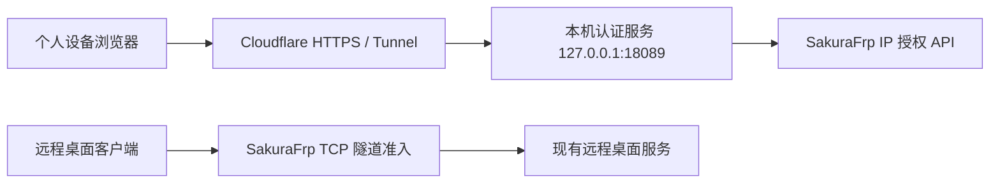

# RDP Access Auth

为通过 SakuraFrp 暴露的远程桌面增加一个 HTTPS 认证入口。访问者先完成网页认证，再使用原远程桌面客户端连接；未经授权的公网 IP 会在进入 RDP 登录环节之前被拦截。

本项目适合个人远程桌面，后端为 Python、Flask、SQLite 和 WebAuthn，通过 Cloudflare Tunnel 提供 HTTPS 页面，通过 SakuraFrp API 为来源 IPv4 授权。

## 功能

| 认证方式 | 行为 |
| --- | --- |
| 固定访问密码 | 至少 16 位，包含大小写字母、数字和特殊符号；可重复使用 |
| 临时访问密码 | 3 个随机中文词，来自 Minecraft、原神与美食；该方式认证成功后立即轮换，并显示下一条 |
| 通行密钥 | WebAuthn，要求设备完成用户验证；支持多个密钥、手机跨设备确认和删除密钥 |

- 三种方式任选其一，固定密码和通行密钥认证不会轮换临时密码。
- 当前临时密码加密保存在 SQLite 中；登录后可在 10 分钟内进入凭据管理页查看，查看不触发轮换。
- 同一 IP 连续失败 5 次封禁 15 分钟；10 分钟内 5 个不同 IP 被封禁，全站锁定 15 分钟。
- 原生 IP 授权期限为 6 小时，到期后的新连接需重新认证。
- 保留 CSRF、来源校验、防重放的单次 WebAuthn 挑战、Secure/HttpOnly Cookie 和 no-store 页面策略。
- 浏览器通过 IPv6 访问时，会检测用于远程桌面连接的公网 IPv4，也支持手动填写。

## 架构与适用范围



这是按公网 IP 放行的单用户入口：共享一个公网出口的设备会共享这次准入，远程桌面仍要求系统账户登录。浏览器的 IPv4 出口必须与 RDP 客户端一致。项目不安装或代替 RDP 服务，也不能阻止公网端口本身被扫描发现。

6 小时由 SakuraFrp 的 `auth_time` 执行，不是浏览器 Cookie 的存活时间。到期后拦截新连接，不承诺强制断开已经建立的会话。重启 frpc 会清除 IP 授权缓存。启用全站锁定后，攻击者也可能通过多个 IP 暂时阻止正常用户认证，可使用本机管理工具解封。

## 运行要求

- 一台持续联网的 Linux 主机；以下采用 systemd 部署，开发验证环境为 Python 3.14。
- 已正常工作的远程桌面服务，以及指向它的 SakuraFrp TCP 隧道。
- SakuraFrp API Token 和目标隧道 ID。
- 托管到 Cloudflare 的域名，以及独立认证子域名，例如 `auth.example.com`。
- 安装 [cloudflared](https://developers.cloudflare.com/cloudflare-one/connections/connect-networks/downloads/)。模板默认路径 `/usr/bin/cloudflared`，请按实际安装位置调整。

下文的域名、端口、隧道 ID 均为示例，部署前替换为自己的值。

## 部署

### 1. 准备 Python 环境和词库

在下载或克隆后的项目目录中执行：

```bash
python3 -m venv .venv
.venv/bin/python -m pip install -r requirements.txt
.venv/bin/python tools/build_wordlist.py --download
```

首次构建会下载词库并生成 `wordlists/objects.json`。数据源包括 THUOCL 饮食词库、Minecraft 简体中文名称以及 genshin-db 原神中文名称；来源与 SHA-256 快照见 `wordlists/sources.json`。当前快照可生成 12,095 个词。

原神 API 会更新。如果下载数据与快照不同，程序会停止；确认接受更新后执行：

```bash
.venv/bin/python tools/build_wordlist.py --download --refresh-sources
```

原始下载内容保存在 `.cache/wordlists/`，生成文件和缓存均被 Git 忽略。更换词库不会重置已有临时密码；重新启动认证服务后，下一次正常轮换才使用新词库。

### 2. 生成私密配置

```bash
.venv/bin/python tools/init_config.py \
  --hostname auth.example.com \
  --rdp-address desktop.example.com:26869 \
  --tunnel-id 12345
```

工具会在终端隐藏输入固定访问密码和 SakuraFrp API Token，生成随机密码盐与会话密钥，写入权限为 `0600` 的 `private/portal-settings.json`。不会覆盖现有配置。`portal-settings.example.json` 仅说明结构，不可直接部署。

配置中的 `session_key` 还用于派生临时密码加密密钥和通行密钥账户标识，应与状态数据库一起备份；运行后不要随意重新生成。

### 3. 安装认证服务

以下命令仍在项目目录执行。应用代码放在 `/opt/rdp-access-auth`，凭据放在 `/etc/rdp-access-auth`，运行状态由 systemd 保存到 `/var/lib/rdp-access-auth`。

```bash
sudo install -d -m 755 /opt/rdp-access-auth/wordlists /opt/rdp-access-auth/tools
sudo install -m 644 portal.py portal.html auth_credentials.py auth_guard.py \
  requirements.txt requirements-runtime.txt /opt/rdp-access-auth/
sudo install -m 644 wordlists/objects.json /opt/rdp-access-auth/wordlists/
sudo install -m 644 tools/admin.py /opt/rdp-access-auth/tools/
sudo python3 -m venv /opt/rdp-access-auth/.venv
sudo /opt/rdp-access-auth/.venv/bin/python -m pip install -r /opt/rdp-access-auth/requirements.txt
sudo install -d -m 700 /etc/rdp-access-auth
sudo install -m 600 private/portal-settings.json /etc/rdp-access-auth/portal-settings.json
sudo install -m 644 deployment/rdp-access-auth.service /etc/systemd/system/
sudo systemctl daemon-reload
sudo systemctl enable --now rdp-access-auth.service
curl -H 'Host: auth.example.com' http://127.0.0.1:18089/healthz
```

健康检查应返回 `ok`。如果使用启用 SELinux 的发行版，应按发行版策略恢复新文件的标签，例如执行 `restorecon -RF /opt/rdp-access-auth /etc/rdp-access-auth`。

服务使用 `DynamicUser`、私有状态目录和只读系统保护。应用只接受来自 loopback 的 Cloudflare 转发请求，不应把 18089 端口直接开放到公网。

### 4. 配置 Cloudflare Tunnel

先以普通用户创建专用 Tunnel：

```bash
cloudflared tunnel login
cloudflared tunnel create rdp-access-auth
cloudflared tunnel route dns rdp-access-auth auth.example.com
```

创建命令会输出 Tunnel UUID 和凭据文件位置。将 `TUNNEL_UUID` 替换为实际 UUID，再执行：

```bash
TUNNEL_UUID=替换为实际UUID
sudo install -m 600 "$HOME/.cloudflared/$TUNNEL_UUID.json" /etc/rdp-access-auth/cloudflare-tunnel.json
sudo install -m 600 deployment/cloudflared.example.yml /etc/rdp-access-auth/cloudflared.yml
sudoedit /etc/rdp-access-auth/cloudflared.yml
```

编辑配置中的 `tunnel`、`hostname` 和 `httpHostHeader`。认证域名必须与 `portal-settings.json` 一致。模板的 `credentials-file` 指向 systemd 注入的凭据路径，应与提供的服务单元配套使用。

```bash
sudo install -m 644 deployment/cloudflared-rdp-access.service /etc/systemd/system/
sudo systemctl daemon-reload
sudo systemctl enable --now cloudflared-rdp-access.service
```

现在应能打开 `https://auth.example.com`。浏览器应允许 Cookie，通行密钥需要安全 HTTPS 上下文。Cloudflare 为认证域名管理 HTTPS 证书。

### 5. 启用 SakuraFrp 准入规则

在原 RDP TCP 隧道的额外配置中设置：

```ini
auth_mode = server
auth_time = 6h
```

保存后重启该隧道或 frpc。认证页面会调用 SakuraFrp 的 `/v4/tunnel/auth` 接口，为所填 IPv4 发放准入。固定密码、临时密码和通行密钥共同使用此规则。

原 RDP 域名如 `desktop.example.com` 应保持“仅 DNS”。普通 Cloudflare 橙云代理不能直接承载原生 RDP。认证域名通过独立 Cloudflare Tunnel 提供 HTTPS。

### 6. 首次登录与通行密钥绑定

1. 在个人设备上打开认证域名，用固定访问密码登录。
2. 成功页进入“绑定通行密钥 / 查看当前临时密码”。
3. 绑定通行密钥并按设备提示使用指纹、面容、PIN、手机或安全密钥确认；也可保存当前临时密码作为备用方式。
4. 用 RDP 客户端连接原域名和端口，再使用系统账户登录。

临时密码成功使用一次后会作废，成功页显示下一条。固定密码或通行密钥登录不会改变它。忘记保存下一条时，可用固定密码或通行密钥登录管理页查看。

浏览器与远程桌面应使用同一公网 IPv4 出口。开代理时，对认证域名、RDP 域名、`api.ipify.org` 和 `ipv4.icanhazip.com` 使用一致的路由策略。

## 维护与排查

```bash
systemctl status rdp-access-auth.service cloudflared-rdp-access.service
journalctl -u rdp-access-auth.service -u cloudflared-rdp-access.service --since '10 minutes ago'
sudo python3 /opt/rdp-access-auth/tools/admin.py status
sudo python3 /opt/rdp-access-auth/tools/admin.py unlock
```

`unlock` 只解除本机数据库中的认证封禁，不修改密码或通行密钥。其他部署路径可通过 `--state /path/to/state.sqlite3` 指定数据库。

- 403：检查认证域名、转发 Host、HTTPS、Cookie 和 Cloudflare Tunnel 是否按模板连接 loopback。
- 502：检查 Tunnel 是否能连接本机 18089，以及 SakuraFrp Token、隧道 ID 和 API 网络连通性。
- 已授权但 RDP 不通：核对网页授权的 IPv4 与 RDP 出口一致，确认原桌面服务在线。
- 通行密钥无法绑定：使用支持 WebAuthn 的现代浏览器；跨设备确认时按浏览器提示启用蓝牙。设备不支持本机保存时可用手机或安全密钥。
- 笔记本休眠、断网或 frpc 重启：恢复联网后重新授权。

备份应包含配置与 SQLite 数据库，并保持私密。可停止认证服务后备份数据库，或使用 SQLite 的在线备份功能。升级时保留这两者，更新源码、依赖后重启认证服务。

## 开发与测试

```bash
.venv/bin/python -m pip install -r requirements.txt
.venv/bin/python -m unittest -q test_auth_guard.py test_portal.py
```

单元测试使用临时数据库和合成词库，不需要真实密码、Token、域名、Cloudflare 或 SakuraFrp 账户。覆盖密码轮换、并发、封禁、CSRF、来源、IPv4 和 WebAuthn 签名/重放等行为。仓库提供 GitHub Actions 测试工作流。

## 项目结构

```text
portal.py / portal.html        网页、接口与准入流程
auth_credentials.py           临时密码与通行密钥
auth_guard.py                 封禁、限流和并发控制
tools/                        配置初始化、词库构建、本机管理
deployment/                   systemd 与 Cloudflare Tunnel 模板
wordlists/sources.json         公开词库来源快照
test_*.py                     离线测试
```

## 许可证与第三方数据

项目代码采用 [MIT License](LICENSE)。游戏和美食词库由部署者从公开来源下载，权利仍属于相应作者或权利人，详见 [词库来源说明](wordlists/readme.md)。本项目与 Cloudflare、SakuraFrp、Minecraft、原神及词库维护者没有从属或背书关系。
