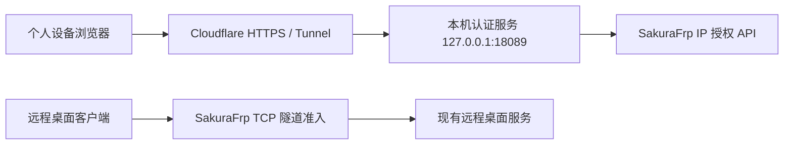

# RDP Access Auth

为通过 SakuraFrp 暴露的远程桌面增加一个 HTTPS 认证入口。访问者先完成网页认证，再使用原远程桌面客户端连接；未经授权的公网 IP 会在进入 RDP 登录环节之前被拦截。

本项目适合个人远程桌面，后端为 Python、Flask、SQLite 和 WebAuthn，通过 Cloudflare Tunnel 提供 HTTPS 页面，通过 SakuraFrp API 为来源 IPv4 授权。

## RPM / DEB 安装与首次部署

面向普通用户提供 **RPM 和 DEB 安装包**。软件包包含项目、浏览器界面和所需 Python 库；Python 运行时、systemd、sudo 等由系统包管理器安装。用户无需选择 Python 命令、创建虚拟环境或运行 pip。

软件包仅安装程序和应用菜单入口，**安装时不会收集凭据、覆盖已有配置或自动启用服务**。首次部署由用户主动运行向导。

```bash
# Fedora：安装下载的 RPM（示例为本项目的 Fedora 44 / x86_64 构建）
sudo dnf install ./rdp-access-auth-0.2.0-1.fc44.x86_64.rpm

# Debian / Ubuntu：使用为该发行版及 Python 版本构建的 DEB
sudo apt install ./rdp-access-auth_版本_py版本_架构.deb
```

安装后，从应用菜单打开 **RDP Access Auth**。助手先检查本机：已有标准或旧版部署时打开对应管理页，尚未部署才打开首次部署向导。也可使用：

```bash
rdp-auth launch         # 自动识别部署，打开管理页或首次向导
rdp-auth deploy --gui   # 显式打开首次部署向导
rdp-auth deploy         # 终端逐项询问，密码和 Token 隐藏输入
rdp-auth deploy --dry-run  # 只查看部署位置和已有部署冲突
```

首次部署需要系统权限，`deploy` 会通过 sudo 请求管理员密码。浏览器会以原桌面用户身份打开；无法自动打开时，复制终端输出的完整链接即可。无桌面环境可使用终端向导。图形向导的本机端口默认为 18124，可通过 `--port` 修改；`--no-open` 仅输出链接。

向导需要这些信息：

| 信息 | 说明 |
| --- | --- |
| 认证域名 | 例如 `auth.example.com`，用于浏览器 HTTPS 认证入口 |
| RDP 连接地址 | 已正常工作的远程桌面域名或 IP 与端口 |
| SakuraFrp 隧道 ID、API Token | 已建立指向远程桌面的 TCP 隧道，并设置 `auth_mode = server` 和需要的 `auth_time` |
| 固定访问密码 | 16～128 位，含大小写字母、数字和特殊符号 |
| Cloudflare Tunnel Token | 在 Cloudflare 控制台创建远程管理的 Tunnel，复制安装命令中的 Token 部分 |
| 本机认证端口 | 默认 18089；在 Cloudflare Tunnel 配置“认证域名 → `http://127.0.0.1:18089`”，更换端口时同步修改路由 |
| Turnstile / 已有词库 | 可选；词库留空时自动下载并核对来源快照 |

向导先在临时目录中校验输入、准备词库，并下载固定版本、校验 SHA-256 的 cloudflared。准备完成后展示具体计划，点击确认才会写入系统、注册并启动服务、启用开机自启，以及执行本机健康检查。配置保存在 `/etc/rdp-access-auth`，Token 通过 systemd `LoadCredential` 传递，不放在进程命令行中。Cloudflare 连接器安装到 `/usr/local/libexec/rdp-access-auth/cloudflared`；不会替换系统已有的 cloudflared 命令。

向导负责本机组件安装。远程桌面服务、SakuraFrp 隧道、Cloudflare 账户和域名路由需提前准备，向导不创建账户或修改远程平台配置。“部署完成”表示本机认证健康检查通过且两个服务已启动，仍需打开认证域名验证 HTTPS 路由、登录和真实 RDP 连接。

检测到标准或旧版部署时会拒绝覆盖。部署文件写入后若启动失败，会尝试停止本次创建的服务，并保留配置、数据库和部署记录供排查；不要重新初始化凭据。后续管理使用：

```bash
sudo rdp-auth --profile system gui
sudo rdp-auth --profile system status
sudo rdp-auth --profile system service logs
sudo rdp-auth --profile system --service cloudflared-rdp-access.service service logs
```

更新软件包保留配置和状态，已使用软件包程序的服务需在管理页中重启以加载新代码。卸载软件包时会停止向导创建的服务及已迁移的认证服务，保留私密配置、数据库、备份和服务覆盖文件；重新安装后可继续管理。

### 已有部署迁移

`rdp-auth launch` 会识别旧版 `/etc/rdp-auth`（`rdp-auth.service`）与标准 `/etc/rdp-access-auth`（`rdp-access-auth.service`）。同时存在两种布局时优先打开正在运行的部署，也可用 `rdp-auth --profile legacy launch` 或 `rdp-auth --profile system launch` 指定。目录残留或配置损坏仍进入管理页排查，不会触发首次初始化。

管理页的“迁移到软件包版本”先检查现有服务、配置、词库和数据库，展示具体路径和原端口。点击“备份并迁移”后，在临时副本上验证新版兼容性，暂停认证服务，用 SQLite 备份接口保存完整数据库（含 WAL 中已提交的数据），再通过专用 systemd 覆盖文件切换到 `/usr/lib/rdp-access-auth`。原配置文件、会话密钥、密码哈希、通行密钥、临时密码、服务名、端口与开机启动设置均沿用；Cloudflare 和 SakuraFrp 连接器继续使用原配置。

健康检查失败时恢复原程序和数据库；进程中断或自动恢复失败时，下次打开管理页会提供“恢复原服务”。备份位于原配置目录下的 `migration-backups/`，迁移记录为 `package-migration.json`。原代码目录保留，便于恢复。迁移期间请保持终端运行；自定义服务名、状态目录或启动方式不在自动迁移范围内。

0.3.1 修复了迁移服务的凭据路径引号问题。0.3.0 若出现 `243/CREDENTIALS`，升级到 0.3.1 后重新打开管理页即可重试；管理页会保留上次失败原因。维护者可运行 `python3 tools/check_migration_systemd.py`，使用临时用户服务检查真实 systemd 的凭据解析，无需操作已部署的认证服务。

```bash
sudo rdp-auth --profile legacy migrate --dry-run  # 只展示计划
rdp-auth --profile legacy migrate                # 终端确认后迁移，自动请求 sudo
rdp-auth --profile legacy migrate --recover      # 恢复未完成的迁移
```

迁移成功后仍使用原档案管理，例如 `sudo rdp-auth --profile legacy gui`；以后更新 RPM 并重启 `rdp-auth.service` 即可，无需重新填写凭据。

管理页按服务使用的程序显示部署类型：迁移成功或直接使用软件包部署时显示“软件包部署”，并隐藏迁移入口。保留 `legacy` 档案和原路径不代表仍在运行旧版；只有旧版程序或待完成、待恢复的迁移才显示迁移面板。

RPM 的包名为 `rdp-access-auth`，应用显示名为 **RDP Access Auth**，作者与打包者为 **a彬彬a**。桌面图标安装到标准 hicolor 图标目录，软件中心信息由 AppStream 提供；项目使用 MIT，`rpm -qi` 的 `License` 字段同时列出随包分发依赖的许可证。许可证全文通过 RPM `%license` 安装，作者说明通过 `%doc` 安装。

### 教程中的助手链接

安装软件包后，桌面环境通过 `x-scheme-handler/rdp-auth` 识别以下链接；浏览器可能先询问是否打开外部应用。

| 链接 | 打开的功能 |
| --- | --- |
| `rdp-auth://open` | 自动识别：已有部署进入管理，否则打开首次部署 |
| `rdp-auth://manage` | 管理页面 |
| `rdp-auth://migrate` | 管理页的迁移面板，展示条件与计划 |
| `rdp-auth://logs` | 管理页并读取服务日志 |
| `rdp-auth://deploy` | 首次部署入口；检测到已有部署时进入管理 |

可追加 `?profile=legacy` 或 `?profile=system` 指定已有部署，例如 `rdp-auth://migrate?profile=legacy`；默认 `profile=auto`。链接只导航到功能，不执行迁移、重启、配置修改，也不接收密码、Token、文件路径或命令。没有部署时先进入首次向导。

教程 HTML 示例：

```html
<a href="rdp-auth://migrate">打开助手，检查迁移</a>
<a href="rdp-auth://logs?profile=legacy">查看旧版服务日志</a>
```

部分文档平台会过滤自定义协议，建议同时提供终端命令作为备用入口：

```bash
rdp-auth launch 'rdp-auth://migrate?profile=legacy'
xdg-mime query default x-scheme-handler/rdp-auth
```

**兼容性：** 安装包按 CPU 架构和系统 Python 次版本构建，不能跨 ABI 混装。当前本机产物对应 x86_64 / Python 3.14（RPM 为 Fedora 44 构建；本机构建的 `py314` DEB 也要求 Python 3.14，不适用于 Ubuntu 24.04 默认 Python）。仓库的 Native packages 工作流分别在 Fedora 44 和 Ubuntu 24.04 中构建匹配的包，产物在 Actions 的 Artifacts 中下载。生成文件本身不代表已经发布到软件源或 Release。

维护者可在匹配的发行版上执行 `tools/build-package rpm` 或 `tools/build-package deb`；需要系统提供 `rpmbuild` 或 `dpkg-deb`、Python venv 和 pip。构建过程只使用项目 `.build/` 与临时目录，输出到 `dist/`，并生成对应的 `.sha256` 校验文件。Python 库版本由 `requirements-package.txt` 固定，库自带的许可证和版本清单随包提供；游戏词库数据不随包分发。

项目更新后，可在项目根目录运行一键脚本。发布新版前先修改 `VERSION`（例如 `1.2.3`），然后执行：

```bash
./build-packages.sh                     # 同时生成 .deb、.rpm 和各自的 .sha256
./build-packages.sh deb                 # 仅生成 DEB
./build-packages.sh rpm                 # 仅生成 RPM
./build-packages.sh --output ./dist/new # 指定输出目录
./build-packages.sh --help
```

脚本使用当前工作区中的代码，无需先提交 Git；默认输出到项目的 `dist/`，同名产物会覆盖。它自动创建或复用 `.build/package-venv` 并通过 pip 安装固定版本依赖，首次运行需要联网。请以普通用户运行，不需要 `sudo`。两种格式都基于当前主机环境构建，不会自动切换发行版；向其他发行版分发时请使用上述 Native packages 工作流或在目标发行版上打包。

首次构建前安装系统工具（二选一，只有这一步需要管理员权限）：

```bash
# Fedora
sudo dnf install python3 python3-pip rpm-build dpkg tar gzip
# Debian / Ubuntu
sudo apt-get install python3 python3-venv python3-pip dpkg-dev rpm tar gzip
```

生成后可以在输出目录运行 `sha256sum -c <安装包文件名>.sha256` 校验文件；脚本只生成安装包，不会安装或重启服务。

## 命令行与浏览器管理

在项目目录执行统一入口，无需选择 Python 环境或记忆脚本路径：

```bash
./rdp-auth          # 显示命令帮助
./rdp-auth gui      # 启动管理页并打开浏览器
```

管理页默认位于 `http://127.0.0.1:18124/`。启动时会输出含临时访问令牌的完整链接，**请使用该完整链接打开**。令牌在浏览器载入后从地址栏移除；服务器重启后需使用新链接。浏览器无法自动打开时，可执行 `./rdp-auth gui --no-open` 并复制链接；端口被占用时使用 `./rdp-auth gui --port 18125`。终端按 `Ctrl+C` 关闭管理服务。

管理界面可创建和修改认证域名、RDP 地址、SakuraFrp 隧道 ID 与 Token、固定密码、Turnstile 和词库路径，也可查看认证状态、解除封禁。显式选择系统部署后，还可启动、停止、重启认证服务和查看日志。界面沿用个人官网的悬浮胶囊导航、编号分区、深浅主题与淡入动效，按运行概览、认证配置、运行维护组织内容；支持手机菜单、减少动态效果、加载失败重试、密码显示切换、未保存提醒以及并发修改冲突提示。图标使用本地打包的 Lucide（ISC），许可随 RPM 的 `%license` 安装，管理页面不需要外部字体或图标网络请求。

**源码模式默认只管理项目内的 `private/portal-settings.json` 和 `private/state.sqlite3`，不自动识别或控制本机已部署服务。** RPM/DEB 的普通本地配置保存到 `$XDG_DATA_HOME/rdp-access-auth`，未设置时使用 `~/.local/share/rdp-access-auth`；管理系统部署仍需显式选择 `--profile system`。本地模式的系统服务按钮禁用；可在另一个终端用 `./rdp-auth serve` 运行当前项目。配置界面与公网认证页面是两个独立入口，管理页仅监听 `127.0.0.1`，不应通过 Cloudflare Tunnel 暴露到公网。GUI 和配置命令仅依赖系统 Python 3 的标准库，启动前无需安装 Flask 或 WebAuthn。

常用命令：

| 操作 | 命令 |
| --- | --- |
| 交互创建配置 | `./rdp-auth config init` |
| 查看配置摘要（不输出密钥） | `./rdp-auth config show` |
| 修改连接地址 | `./rdp-auth config set --rdp-address desktop.example.com:3389` |
| 修改固定密码 | `./rdp-auth config set --password` |
| 更换 SakuraFrp Token | `./rdp-auth config set --sakura-token` |
| 启用或更新 Turnstile | `./rdp-auth config set --turnstile` |
| 关闭 Turnstile | `./rdp-auth config set --disable-turnstile` |
| 校验配置和词库 | `./rdp-auth config validate` |
| 查看运行与认证状态 | `./rdp-auth status`（脚本可加 `--json`） |
| 解除认证封禁 | `./rdp-auth unlock` |
| 安装认证服务依赖 | `./rdp-auth setup` |
| 下载并构建词库 | `./rdp-auth wordlist --download` |
| 前台运行认证服务 | `./rdp-auth serve`（默认 `127.0.0.1:18089`，可用 `--port` 修改） |
| 预览认证页 | `./rdp-auth preview` |
| 离线回归测试 | `./rdp-auth test` |

所有子命令支持 `--help`。密码和 Token 通过终端隐藏输入，不作为命令参数；管理页自动填入已有 Token 和 Secret key，默认以掩码显示，点击眼睛可查看并直接修改。固定密码只保存校验哈希，无法还原原文；已有密码显示“已设置”，点击“更换密码”后输入新密码，也可取消更换。未修改的凭据不会随保存重复提交。新配置需要填写固定密码与 Token；Turnstile 使用明确的关闭开关清除密钥。

修改时保留原 `session_key`、未修改的密码哈希和其他配置字段。写入采用文件锁、原子替换与 `0600` 权限，上一版保存到同目录的 `portal-settings.json.bak`（自定义文件名时同样追加 `.bak`）。备份包含私密信息，应与配置一起妥善保管。**保存配置不会自动重启服务**：前台运行时退出后重新执行 `serve`；系统部署在管理页点击“重启”，或执行对应的 `service restart`。更换认证域名后还需同步 Cloudflare Tunnel，并在新域名重新绑定通行密钥。

只有需要管理已部署服务时，才显式选择配置档案；全局选项放在子命令之前：

| 档案 | 配置文件 | 数据库 | 服务 |
| --- | --- | --- | --- |
| `local`（默认） | 项目内 `private/portal-settings.json` | 项目内 `private/state.sqlite3` | 不控制 systemd |
| `system` | `/etc/rdp-access-auth/portal-settings.json` | `/var/lib/rdp-access-auth/state.sqlite3` | `rdp-access-auth.service` |
| `legacy` | `/etc/rdp-auth/portal-settings.json` | `/var/lib/rdp-auth/state.sqlite3` | `rdp-auth.service` |

例如，标准部署使用 `sudo ./rdp-auth --profile system gui --no-open`，然后在普通用户的浏览器中打开终端输出的完整链接；旧部署将 `system` 换成 `legacy`。`sudo ./rdp-auth --profile system service restart` 会重启选定的服务。普通管理命令不会自行调用 sudo，权限不足时给出明确提示；首次部署命令 `deploy` 会主动请求 sudo 权限。

自定义位置可使用 `./rdp-auth --config /path/settings.json --state /path/state.sqlite3 gui`。自定义 systemd 服务还需显式指定部署档案和 `--service example.service`，用户服务可加 `--scope user`。这些选择会在管理页显示；它们不会迁移、覆盖或安装已有部署。`serve` 始终运行当前项目代码，`wordlist` 始终构建当前项目词库，系统部署的代码与词库更新仍按下文安装步骤操作。

## 功能

| 认证方式     | 行为                                                                               |
| ------------ | ---------------------------------------------------------------------------------- |
| 固定访问密码 | 至少 16 位，包含大小写字母、数字和特殊符号；可重复使用                             |
| 临时访问密码 | 3 个随机中文词，来自 Minecraft、原神与美食；该方式认证成功后立即轮换，并显示下一条 |
| 通行密钥     | WebAuthn，要求设备完成用户验证；支持多个密钥、手机跨设备确认和删除密钥             |

- 三种方式任选其一，固定密码和通行密钥认证不会轮换临时密码。
- 当前临时密码加密保存在 SQLite 中；登录后可在 10 分钟内进入凭据管理页查看，查看不触发轮换。
- 同一 IP 连续失败 5 次封禁 15 分钟；10 分钟内 5 个不同 IP 被封禁，全站锁定 15 分钟。
- 原生 IP 授权期限为 6 小时，到期后的新连接需重新认证。
- 保留 CSRF、来源校验、防重放的单次 WebAuthn 挑战、Secure/HttpOnly Cookie 和 no-store 页面策略。
- 浏览器通过 IPv6 访问时，会检测用于远程桌面连接的公网 IPv4，也支持手动填写。

## 页面样式

认证入口、授权成功页与凭据管理页沿用个人主页的深蓝灰 / 天蓝配色、柔和光晕、胶囊导航与圆角卡片，导航展示项目图标与 RDP Access Auth 名称，提供太阳 / 月亮主题按钮和项目官网入口。主题默认跟随系统，手动切换后在当前站点记住选择（不同域名的偏好分别保存）。桌面采用左侧连接说明、右侧认证卡片的分栏布局，手机上切为单列；固定密码、临时密码与通行密钥使用胶囊标签在页面内切换，不整页刷新；保留已输入内容和 IPv4，支持浏览器前进 / 后退，未启用 JavaScript 时仍可通过链接切换。切换会更新人机验证的认证方式，并取消未完成的通行密钥请求；错误提示保留在表单上方。授权成功后展示连接地址，凭据管理沿用同一套卡片。项目图标使用去除背景的 PNG，缩小后内嵌页面与标签页，无需外部图片请求。导航、标题、卡片依次入场，主题切换、悬停和详情展开采用短动效；开启减少动态效果时禁用动画与过渡。认证卡片使用与官网演示相同的图标标题、方式标签、带图标输入框、IPv4 摘要和授权按钮；固定密码和临时密码带显示 / 隐藏按钮，临时密码按三个词分格输入，服务端自动连接，无需输入横线，禁用 JavaScript 时也可提交。导航书本图标进入部署文档，房子图标进入项目官网；滚动条采用深浅主题自定义轨道与圆角滑块。保留页面字号与外层布局，精简重复提示。支持手机窄屏和键盘焦点；人机验证在最窄屏幕使用紧凑尺寸。

样式、主题初始化及页面结构集中在 `portal.html`，无需额外前端构建，也不需要生成 GitHub Release。部署时同步更新 `portal.html` 与 `portal.py`（包含图标所需的 CSP），然后重启认证服务生效；原有认证逻辑与凭据配置不受样式更新影响。

## 架构与适用范围



这是按公网 IP 放行的单用户入口：共享一个公网出口的设备会共享这次准入，远程桌面仍要求系统账户登录。浏览器的 IPv4 出口必须与 RDP 客户端一致。项目不安装或代替 RDP 服务，也不能阻止公网端口本身被扫描发现。

6 小时由 SakuraFrp 的 `auth_time` 执行，不是浏览器 Cookie 的存活时间。到期后拦截新连接，不承诺强制断开已经建立的会话。重启 frpc 会清除 IP 授权缓存。启用全站锁定后，攻击者也可能通过多个 IP 暂时阻止正常用户认证，可使用本机管理工具解封。

## 运行要求

- 一台持续联网的 Linux 主机；以下采用 systemd 部署，开发验证环境为 Python 3.14。
- 已正常工作的远程桌面服务，以及指向它的 SakuraFrp TCP 隧道。
- SakuraFrp API Token 和目标隧道 ID。
- 托管到 Cloudflare 的域名，以及独立认证子域名，例如 `auth.example.com`。
- 安装 [cloudflared](https://developers.cloudflare.com/cloudflare-one/connections/connect-networks/downloads/)。模板默认路径 `/usr/bin/cloudflared`，请按实际安装位置调整。

下文的域名、端口、隧道 ID 均为示例，部署前替换为自己的值。

## 部署

### 1. 准备 Python 环境和词库

在下载或克隆后的项目目录中执行：

```bash
./rdp-auth setup
./rdp-auth wordlist --download
```

首次构建会下载词库并生成 `wordlists/objects.json`。数据源包括 THUOCL 饮食词库、Minecraft 简体中文名称以及 genshin-db 原神中文名称；来源与 SHA-256 快照见 `wordlists/sources.json`。当前快照可生成 12,095 个词。

原神 API 会更新。如果下载数据与快照不同，程序会停止；确认接受更新后执行：

```bash
./rdp-auth wordlist --download --refresh-sources
```

原始下载内容保存在 `.cache/wordlists/`，生成文件和缓存均被 Git 忽略。更换词库不会重置已有临时密码；重新启动认证服务后，下一次正常轮换才使用新词库。

### 2. 生成私密配置

```bash
./rdp-auth config init \
  --hostname auth.example.com \
  --rdp-address desktop.example.com:26869 \
  --tunnel-id 12345
```

也可执行 `./rdp-auth gui` 在浏览器中填写相同配置。命令行工具会在终端隐藏输入固定访问密码和 SakuraFrp API Token，生成随机密码盐与会话密钥，写入权限为 `0600` 的 `private/portal-settings.json`。不会覆盖现有配置。`portal-settings.example.json` 仅说明结构，不可直接部署。

配置中的 `session_key` 还用于派生临时密码加密密钥和通行密钥账户标识，应与状态数据库一起备份；运行后不要随意重新生成。

### 3. 安装认证服务

以下命令仍在项目目录执行。应用代码放在 `/opt/rdp-access-auth`，凭据放在 `/etc/rdp-access-auth`，运行状态由 systemd 保存到 `/var/lib/rdp-access-auth`。

```bash
sudo install -d -m 755 /opt/rdp-access-auth/wordlists /opt/rdp-access-auth/tools /opt/rdp-access-auth/admin_ui /opt/rdp-access-auth/deployment
sudo install -m 644 portal.py portal.html auth_credentials.py auth_guard.py \
  management.py management_web.py rdp_manager.py package_bootstrap.py deploy.py VERSION \
  requirements.txt requirements-runtime.txt /opt/rdp-access-auth/
sudo install -m 755 rdp-auth /opt/rdp-access-auth/
sudo install -m 644 admin_ui/index.html admin_ui/app.css admin_ui/app.js /opt/rdp-access-auth/admin_ui/
sudo install -m 644 admin_ui/deploy.html admin_ui/deploy.css admin_ui/deploy.js /opt/rdp-access-auth/admin_ui/
sudo install -m 644 deployment/cloudflared-downloads.json /opt/rdp-access-auth/deployment/
sudo install -m 644 wordlists/objects.json /opt/rdp-access-auth/wordlists/
sudo install -m 644 wordlists/sources.json /opt/rdp-access-auth/wordlists/
sudo install -m 644 tools/admin.py tools/build_wordlist.py tools/preview.py /opt/rdp-access-auth/tools/
sudo /opt/rdp-access-auth/rdp-auth setup
sudo install -d -m 700 /etc/rdp-access-auth
sudo install -m 600 private/portal-settings.json /etc/rdp-access-auth/portal-settings.json
sudo install -m 644 deployment/rdp-access-auth.service /etc/systemd/system/
sudo systemctl daemon-reload
sudo systemctl enable --now rdp-access-auth.service
curl -H 'Host: auth.example.com' http://127.0.0.1:18089/healthz
```

健康检查应返回 `ok`。如果使用启用 SELinux 的发行版，应按发行版策略恢复新文件的标签，例如执行 `restorecon -RF /opt/rdp-access-auth /etc/rdp-access-auth`。

服务使用 `DynamicUser`、私有状态目录和只读系统保护。应用只接受来自 loopback 的 Cloudflare 转发请求，不应把 18089 端口直接开放到公网。

### 4. 配置 Cloudflare Tunnel

先以普通用户创建专用 Tunnel：

```bash
cloudflared tunnel login
cloudflared tunnel create rdp-access-auth
cloudflared tunnel route dns rdp-access-auth auth.example.com
```

创建命令会输出 Tunnel UUID 和凭据文件位置。将 `TUNNEL_UUID` 替换为实际 UUID，再执行：

```bash
TUNNEL_UUID=替换为实际UUID
sudo install -m 600 "$HOME/.cloudflared/$TUNNEL_UUID.json" /etc/rdp-access-auth/cloudflare-tunnel.json
sudo install -m 600 deployment/cloudflared.example.yml /etc/rdp-access-auth/cloudflared.yml
sudoedit /etc/rdp-access-auth/cloudflared.yml
```

编辑配置中的 `tunnel`、`hostname` 和 `httpHostHeader`。认证域名必须与 `portal-settings.json` 一致。模板的 `credentials-file` 指向 systemd 注入的凭据路径，应与提供的服务单元配套使用。

```bash
sudo install -m 644 deployment/cloudflared-rdp-access.service /etc/systemd/system/
sudo systemctl daemon-reload
sudo systemctl enable --now cloudflared-rdp-access.service
```

现在应能打开 `https://auth.example.com`。浏览器应允许 Cookie，通行密钥需要安全 HTTPS 上下文。Cloudflare 为认证域名管理 HTTPS 证书。

### 5. 启用 SakuraFrp 准入规则

在原 RDP TCP 隧道的额外配置中设置：

```ini
auth_mode = server
auth_time = 6h
```

保存后重启该隧道或 frpc。认证页面会调用 SakuraFrp 的 `/v4/tunnel/auth` 接口，为所填 IPv4 发放准入。固定密码、临时密码和通行密钥共同使用此规则。

原 RDP 域名如 `desktop.example.com` 应保持“仅 DNS”。普通 Cloudflare 橙云代理不能直接承载原生 RDP。认证域名通过独立 Cloudflare Tunnel 提供 HTTPS。

### 6. 首次登录与通行密钥绑定

1. 在个人设备上打开认证域名，用固定访问密码登录。
2. 成功页进入“绑定通行密钥 / 查看当前临时密码”。
3. 绑定通行密钥并按设备提示使用指纹、面容、PIN、手机或安全密钥确认；也可保存当前临时密码作为备用方式。
4. 用 RDP 客户端连接原域名和端口，再使用系统账户登录。

临时密码成功使用一次后会作废，成功页显示下一条。固定密码或通行密钥登录不会改变它。忘记保存下一条时，可用固定密码或通行密钥登录管理页查看。

成功页的下一条临时密码旁提供“重新生成”按钮，点击后立即废止上一条并显示新密码；此操作需在临时密码认证后的 10 分钟管理会话内完成。旧页面或正在使用中的密码不能被刷新覆盖。

绑定新的通行密钥必须先通过固定密码认证；临时密码和通行密钥登录不能绑定新密钥。远程主机管理页的“凭据与访问保护”列出已绑定密钥，可逐个解绑，解绑后无法再用该密钥认证。

浏览器与远程桌面应使用同一公网 IPv4 出口。开代理时，对认证域名、RDP 域名、`api.ipify.org` 和 `ipv4.icanhazip.com` 使用一致的路由策略。

## 维护与排查

```bash
systemctl status rdp-access-auth.service cloudflared-rdp-access.service
journalctl -u rdp-access-auth.service -u cloudflared-rdp-access.service --since '10 minutes ago'
sudo /opt/rdp-access-auth/rdp-auth --profile system status
sudo /opt/rdp-access-auth/rdp-auth --profile system unlock
sudo /opt/rdp-access-auth/rdp-auth --profile system gui --no-open
```

`unlock` 只解除选定数据库中的认证封禁，不修改密码或通行密钥。其他部署路径可通过 `--state /path/to/state.sqlite3` 指定数据库，路径选项需放在子命令前。

- 403：检查认证域名、转发 Host、HTTPS、Cookie 和 Cloudflare Tunnel 是否按模板连接 loopback。
- 502：检查 Tunnel 是否能连接本机 18089，以及 SakuraFrp Token、隧道 ID 和 API 网络连通性。
- 已授权但 RDP 不通：核对网页授权的 IPv4 与 RDP 出口一致，确认原桌面服务在线。
- 通行密钥无法绑定：使用支持 WebAuthn 的现代浏览器；跨设备确认时按浏览器提示启用蓝牙。设备不支持本机保存时可用手机或安全密钥。
- 笔记本休眠、断网或 frpc 重启：恢复联网后重新授权。

备份应包含配置与 SQLite 数据库，并保持私密。可停止认证服务后备份数据库，或使用 SQLite 的在线备份功能。升级时保留这两者，更新源码、依赖后重启认证服务。

## 开发与测试

```bash
./rdp-auth setup
./rdp-auth test
```

单元测试使用临时数据库和合成词库，不需要真实密码、Token、域名、Cloudflare 或 SakuraFrp 账户。覆盖密码轮换、并发、封禁、CSRF、来源、IPv4、WebAuthn 签名/重放，以及管理配置的密钥保留、文件权限、备份、并发冲突、本机 HTTP 访问控制与解封。systemd 操作在测试中模拟，不操作已部署服务。管理 HTTP 测试需要允许监听本机临时端口。仓库提供 GitHub Actions 测试工作流。

管理页的真实浏览器回归可使用：

```bash
./rdp-auth setup --browser
./rdp-auth test --browser
```

测试仅使用临时文件，覆盖表单保存、Turnstile 开关、密钥保留、冲突提示、解封、模拟服务操作，以及深浅主题和 320～1440px 布局。测试使用已安装的 Google Chrome，或 Playwright 下载的 Chromium；Linux 还需具备浏览器所需系统库。

### 本地样式预览

```bash
./rdp-auth preview
```

在浏览器打开 `http://127.0.0.1:18123/`，可切换三种认证方式和深浅主题；`/credentials` 可预览凭据管理页。预览使用示例数据，不读取真实配置、不执行授权或密钥操作，也不加载真实人机验证。

## 项目结构

```text
portal.py / portal.html        网页、接口与准入流程
rdp-auth / rdp_manager.py       统一命令行入口与环境选择
management.py                  配置、状态与服务管理的共用逻辑
management_web.py / admin_ui/   本机浏览器管理服务与中文界面
deploy.py                       首次部署、下载校验、服务注册与健康检查
packaging/ / tools/build-package RPM/DEB 打包、应用菜单入口
auth_credentials.py           临时密码与通行密钥
auth_guard.py                 封禁、限流和并发控制
tools/                        配置初始化、词库构建、本机管理
deployment/                   systemd 与 Cloudflare Tunnel 模板
wordlists/sources.json         公开词库来源快照
test_*.py                     离线测试
```

## 许可证与第三方数据

项目代码采用 [MIT License](LICENSE)。游戏和美食词库由部署者从公开来源下载，权利仍属于相应作者或权利人，详见 [词库来源说明](wordlists/readme.md)。本项目与 Cloudflare、SakuraFrp、Minecraft、原神及词库维护者没有从属或背书关系。

## Cloudflare Turnstile（可选）

在 Cloudflare Turnstile 创建或选用已有组件，允许的主机名需包含实际认证域名
（例如 `auth.example.com`）。将 Site key 和 Secret key 分别写入服务器私有配置的
`turnstile_site_key`、`turnstile_secret_key` 字段；可在管理界面启用 Turnstile，或运行
`./rdp-auth config set --turnstile`（系统部署需在 `config` 前指定对应 `--profile`，并使用 sudo）。
两项都为空时不启用，只填写其中一项会拒绝启动。已有部署使用管理工具修改原配置，保留
原密码哈希、会话密钥及其他字段，不要重新初始化。配置文件保持原所有者、0600 权限，
通过现有 systemd `LoadCredential` 提供给服务，然后重启认证服务。
Secret key 不可放进 HTML、源码仓库或日志。示例配置不包含任何真实密钥。

三种登录均需要先通过人机验证，后端在原认证处理器中调用 Siteverify：

| 登录方式 | 处理器                  | Turnstile action  |
| -------- | ----------------------- | ----------------- |
| 固定密码 | `/authorize`            | `login_password`  |
| 临时密码 | `/authorize`            | `login_temporary` |
| 通行密钥 | `/passkeys/auth/verify` | `login_passkey`   |

服务端要求 `success` 严格为 true、action 匹配且 hostname 等于配置的认证域名；
生产环境不会接受 localhost。客户端 IP 取自可信本机 Cloudflare Tunnel 的
`CF-Connecting-IP`，不使用用户填写的 IPv4 做人机校验。
Siteverify 超时为 10 秒，错误时拒绝认证，但不计入密码失败次数、不轮换临时密码。
有效的人机验证不能代替密码或通行密钥。管理页仍使用已认证的短期会话和 CSRF 校验。

令牌由 Cloudflare 限制为一次性、有效期 5 分钟；通行密钥流程每次尝试后重置组件，
普通表单提交后由新页面生成组件。浏览器必须能访问 `challenges.cloudflare.com`，
服务端必须能出站访问它的 Siteverify 接口；页面 CSP 已允许所需脚本和 iframe。

验证：`./rdp-auth test`。
上线时还应使用真实浏览器完成一次登录，并确认重放同一个 Turnstile 令牌被拒绝。
测试中的模拟响应不代替真实组件的部署验证。

`./rdp-auth test --browser` 还会运行认证页面无刷新切换的浏览器回归，使用本地拦截的示例页面与模拟接口，不执行真实授权。
